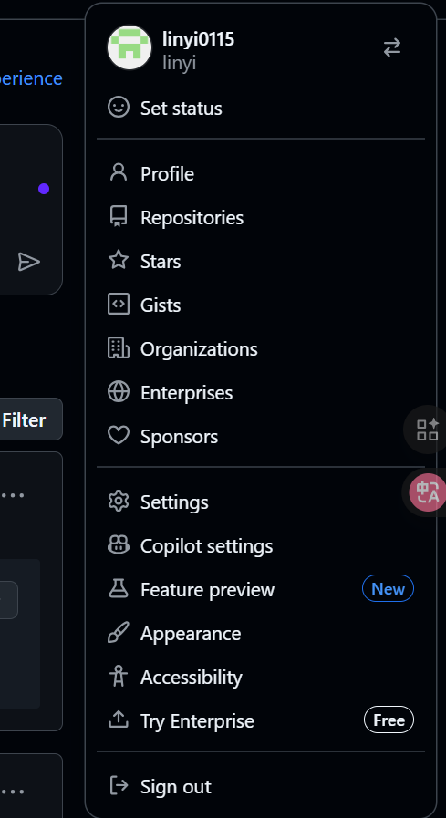

# **let's start our feat step by step!**
> if we have equipped with vscode and git

---

## content（正文内容，三级标题内会再细化每一小步的具体操作和代码）

### step 1:在github中新建一个仓库
1. 注册登录[GitHub官网](https://github.com/)

2. 右上角"repositories"（n pl. 仓库）

进去后选new

> 主页左边有自己的所有仓库的目录预览，也能快捷点new

3. 进行项目的命名，其余可以保持默认，注意**不要勾选自带readme**（新手不友好），空仓库更易于后面本地仓库和远程仓库的交接

4. Congratulations!
第一个仓库就建好啦，接下来我们只需要本地创建文件夹（本地仓库）后继续按步骤来实现git仓库内容的上传

### step 2 在本地搭建仓库并实现内容的修改上传
1. 打开vscode，在左上角功能菜单中选择新建文件夹

2. 在新建文件夹里面添加新文件，随后左上角打开终端

3. 输入`pwd`并enter键执行（后面的叙述中会省略，默认enter执行），确认目录是否有误


>需稍稍学习一下终端的一些基础命令，如pwd（查看当前目录）、ls（列出当前目录所有文件）、cd xxx（打开xxx目录）

4. 进行初始化,开始版本控制
`git init`

5. 对最初的需要保存的文本进行编辑，然后执行命令标记要保存的文件(注意严格区分格式，注意空格大小写单词拼写)
```
git add xxx #xxx为要标记的具体文件路径
git add .   #标记当前目录所有文件
```

6.永久保存当前版本到本地，并编写版本更新注释
- `git commit`:使用后会跳转到vim界面
- 按下键盘a/i键进入编辑模式，输入你要注释的版本信息（如：first commitment）
- esc退出编辑模式，输入英文冒号再输入w（write）q（quite）字母完成编辑并成功保存`:wq`

7. 和自己的远程仓库建立链接并上传版本
- [GitHub官网](https://github.com/)中打开自己新建的仓库，复制其https为前缀的链接（以"https://github.com/linyi0115/git-learning-process.git"为例）

- 添加一个新的远程仓库。指定一个远程仓库的名称和 URL，将其添加到当前仓库中:`git remote add orign https://github.com/linyi0115/git-learning-process.git #名称用origin为例`

- 查看当前分支
`git branch`可能会返回"* master"（master也可能是别的，为你其中一个分支的名称）

- push到git仓库完成我们的feat
`git push origin master:master #:master可以省略，默认你前面填写的分支名`


